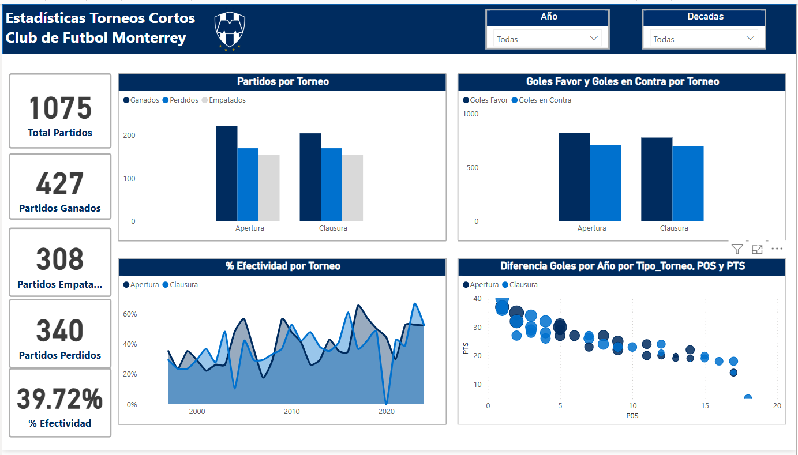
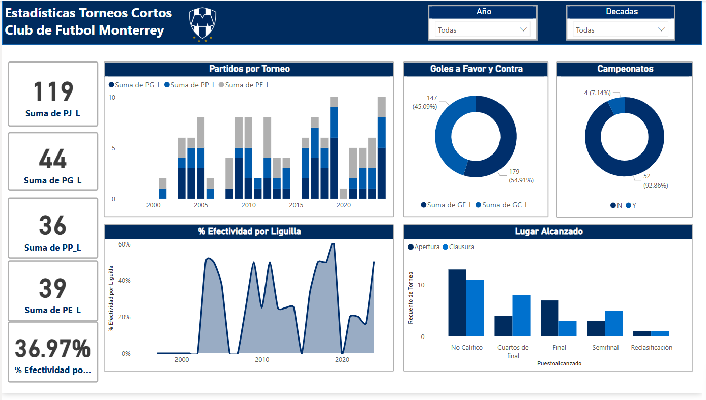
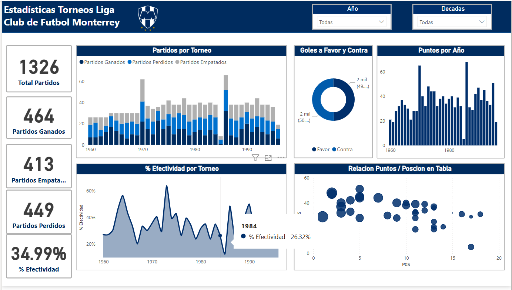

# Project 2 - Python / Rayados

## Overview
Hi!

In this Project I'm using Web Scraping to get a Data Set from Wikipedia using Python, the info I chose is a set of tables about Rayados, a football clubs which I'm a Fan, the Tables contain info about the stadistics of the club in the Local Torunament. 
With the info I also use Python to Clean the Data and use Power Bi to make some Graphics

I split the project in three different Parts, 
- Web Scrapping
- Data Cleaning
- Visalizations.

You can find the respective Links to the code here in Github

Here's the Link to the Source
- **Wikipedia Link:** [Anexo:Estadísticas del Club de Fútbol Monterrey](https://es.wikipedia.org/wiki/Anexo:Estad%C3%ADsticas_del_Club_de_F%C3%BAtbol_Monterrey)

## Code
Here are some code snippets I think are interesting from each part and some images of the graphs.

### Web Scrapping

1. Save the complete table in a variable called “enc_liga”, which will only go through the headers (th) part to save them in a dataframe later on.
```python
for enc_liga in tabla_torneo:
    encabezado_liga = enc_liga.find_all('th')
columnas_liga = [columna.text.strip() for columna in encabezado_liga ]
```
2. With a for loop I went through the table and stored the complete rows in a list, separating the texts, when the length of the list was equal to the number of columns in the existing DF, I inserted the information in the Dataframe.
```python
for tabla in tabla_torneo:
    for row in tabla.find_all('tr')[1:]:
        values = []
        for columns in row.find_all('td'):
            values.append(columns.text.strip())
            #print(values)
            #print(len(values))
            if len(values) == len(columnas_liga):
                df_liga.loc[len(df_liga)] = values
```

### Data Cleaning
1. Creating and Filling a New Column
```python
df_liga['Tipo_Torneo'] = df_liga['Torneo']
df_liga['Tipo_Torneo'] = df_liga['Tipo_Torneo'].str.replace('Invierno','Apertura')
df_liga['Tipo_Torneo'] = df_liga['Tipo_Torneo'].str.replace('Verano','Clausura')
df_liga['Tipo_Torneo'] = df_liga['Tipo_Torneo'].str.replace('Bicentenario','Clausura')
```

2. Calculate a new column based on another column
```python
for x in df_liga.index:
    if df_liga.loc[x,'Año'] <= 1994:
        total_puntos = df_liga.loc[x,"PJ"] * 2
        df_liga.loc[x,"Efectividad"] = efectividad = (df_liga.loc[x,'PTS'] / total_puntos) *100
    else:
        total_puntos = df_liga.loc[x,"PJ"] * 3
        df_liga.loc[x,"Efectividad"] = efectividad = (df_liga.loc[x,'PTS'] / total_puntos) *100
    print(total_puntos, efectividad)
```

3.- Union of two clean tables
```python
df_completo = df_liga.merge(df_liguilla[['Torneo','PJ','PG','PE','PP','GF','GC','DIF','Puestoalcanzado','Campeon']], how = 'left', on = 'Torneo',suffixes =['_FR','_L'])
```

### Power BI Dashboaard
For this dashboard I have decided to divide it into three parts, to show graphics about the Regular Phase of the Modern Tournaments, the Playoffs Phase, and the old format which was like a European League format.

### Regular Phase

Its main objective is to compare performance over time for each competition, in Mexico there are two different tournaments per year, Clausura and Apertura, so I decided to compare both to see in which tournament Monterrey has performed better.

It is interesting that in the Apertura Tournament Rayados has a regular performance over time, scoring more goals and having more wins than in the Claurura Tournament, but in the Clausura, it has better Tournaments doing its best efficiency and finishing in the Top 3 of the League most of the times than in the Apertura Tournaments.

I like to see that if you compare the decade of the 2000's the team was 50 - 50 to finish in the first places vs. the decade of 2010 onwards, where it predominates finishing in the first 8 places that give you access to the Playoff and how the efficiency percentage has been going up.

### PlayOff Phase

For this part, I focused on the PlayOff games that have been played, and over the years the percentage of effectiveness and consistency in PlayOffs appearances has been increasing, making them a more consistent team.

From this graph you can sadly see that this is a team that has reached many finals, but has only been able to win 4 titles, and although they have not finished the decade, they are having very good numbers.

### Old Tournament

This part shows that during the Ligas era, it was a very regular team, always hovering around the mid-table for the most part, and in fact it is interesting that in percentage of effectiveness it is the closest to the average of 33.33%. This is also because it was a long period of time of 36 years, being a very even team in all its statistics.
